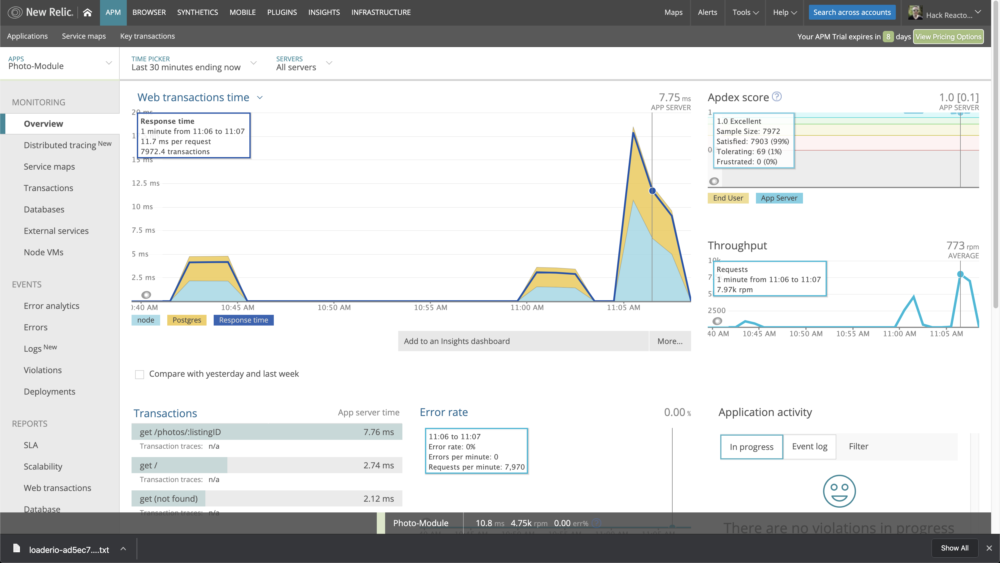
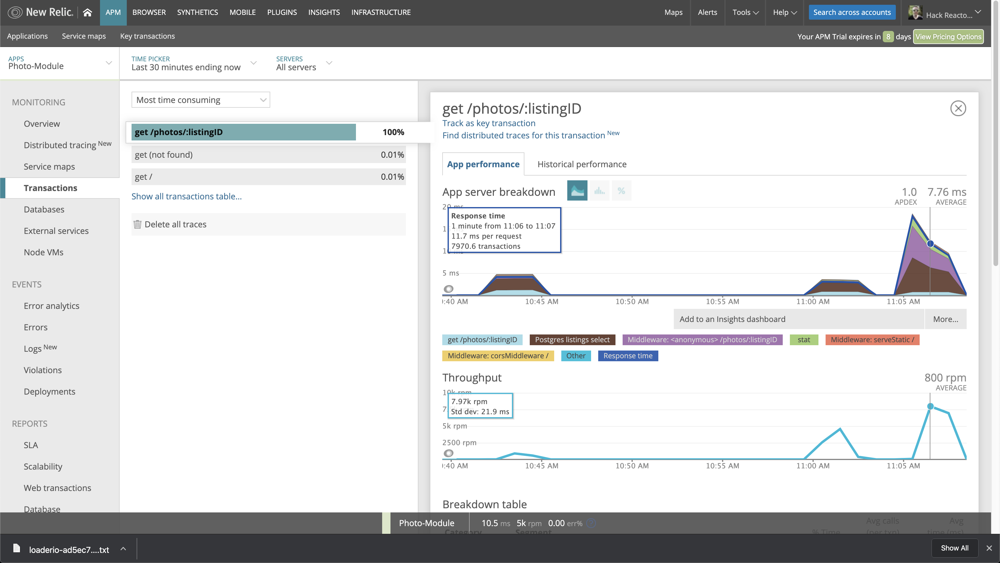
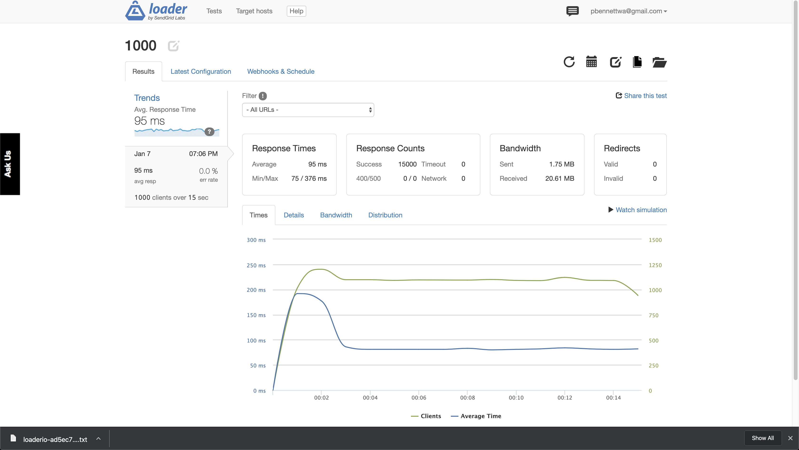

# SpareBnB Photo Module

> Photo Gallery and Carousel Module for SpareBnB, a home rental app


## Screenshots







## Usage

```bash
# Install dependencies
$ npm install

# Create CSV file to insert into PostgresSQL
$ npm run seedFile

# Bundle files with webpack
$ npm run build

# Run the app
$ npm run start
```

> Copy CSV file into into PostgresSQL

## Requirements

- [npm](http://npmjs.com)
- [Node.js](https://nodejs.org/en/download/)
- [Git](https://git-scm.com)
